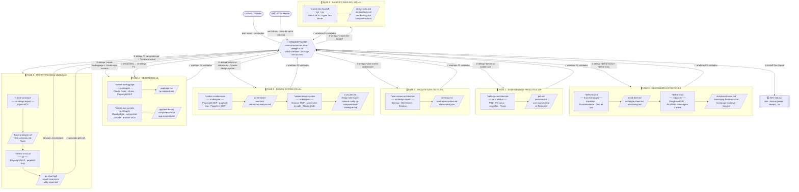

# TÓPICO:

"Metodologia Avançada de Desenvolvimento Frontend Assistido por IA: Do Design à Implementação com Ferramentas de Terminal, Automação e Engenharia de Contexto (2026)"

CONTEXTO:

Busco desenvolver uma metodologia prática e replicável para criação de landing pages, sites e interfaces frontend de alta qualidade utilizando IA. O objetivo é entender como desenvolvedores e designers estão usando ferramentas como Claude Code, Gemini CLI e outros agentes em terminal para acelerar o processo de ideação, design, prototipagem e geração de código. A pesquisa deve mapear fluxos completos — desde a coleta de referências visuais até a geração de código, clonagem de componentes, criação de design systems e automações via MCPs — identificando ferramentas, prompts, práticas emergentes e pipelines que permitam produzir interfaces profissionais com maior velocidade e consistência.

ESCOPO:

1. FLUXO COMPLETO DE DESENVOLVIMENTO COM IA

Mapear o pipeline completo utilizado por desenvolvedores modernos: ideação → coleta de referências → geração de design → criação de design system → geração de código → refinamento → deploy. Identificar como IA participa em cada etapa.

2. DESIGN → CÓDIGO

Ferramentas e técnicas para converter designs em código frontend (HTML, Tailwind, React, Next.js, etc.). Avaliar ferramentas como Figma plugins, geradores de UI, screenshot-to-code, clonagem de interfaces e geração automática de componentes.

3. ENGENHARIA DE CONTEXTO PARA IA

Como fornecer contexto visual e estrutural para modelos de IA:

screenshots de referência

HTML existente

código fonte de páginas

bibliotecas de componentes

design tokens

estrutura de projetos

Investigar técnicas de prompting usadas por desenvolvedores avançados.

4. USO DE IA EM TERMINAL E AGENTES DE DESENVOLVIMENTO

Analisar fluxos usando ferramentas como Claude Code, Gemini CLI, Cursor, Aider, e agentes similares. Entender como desenvolvedores utilizam esses sistemas para:

geração de páginas

refatoração de código

criação de componentes reutilizáveis

scaffolding de projetos

integração com frameworks frontend.

5. EXTRAÇÃO DE PADRÕES VISUAIS E REFERÊNCIAS

Como profissionais coletam referências de design (Dribbble, landing pages, bibliotecas UI) e as utilizam para gerar novas interfaces via IA. Investigar técnicas como:

screenshot prompting

scraping de HTML

clonagem parcial de layouts

reconstrução de componentes.

6. AUTOMAÇÕES E ECOSSISTEMA DE FERRAMENTAS

Identificar ferramentas e automações que ampliam produtividade, incluindo:

MCPs e automações para desenvolvimento

geradores de UI

frameworks de componentes

bibliotecas de design systems

ferramentas de inspeção de páginas

pipelines automáticos de geração frontend.

REQUISITOS:

Priorizar práticas emergentes de 2025–2026 com evidências reais de uso por desenvolvedores, especialmente usando agentes em TUI.

Incluir exemplos práticos de workflows completos (passo a passo).

Diferenciar ferramentas experimentais vs. stacks confiáveis em produção.

Focar em aplicações práticas para desenvolvedores individuais ou pequenas equipes.

FONTES RECOMENDADAS:

Transcrições de vídeos e tutoriais do YouTube sobre desenvolvimento com IA.

Discussões técnicas em comunidades como Reddit, X (Twitter), Hacker News e Discords de dev.

Documentação e exemplos de ferramentas como Claude Code, Gemini CLI, Cursor, Aider e similares.

Repositórios open source e exemplos de projetos no GitHub relacionados a AI-assisted frontend.

RESULTADOS ESPERADOS:

1. Uma metodologia estruturada para criação de landing pages e interfaces com IA (pipeline completo).
2. Lista das ferramentas mais eficazes para cada etapa: ideação, design, geração de código e refinamento.
3. Exemplos reais de workflows usados por desenvolvedores avançados.
4. Framework de engenharia de contexto para melhorar resultados com IA (prompts + inputs visuais + código).
5. Playbooks práticos para gerar páginas e componentes frontend de alta qualidade com rapidez.

A seguir está uma proposta de metodologia 2026, focada em devs solo e pequenas equipes, usando IA (especialmente agentes em terminal) para ir de ideia → design → código → deploy em frontends modernos.

***

## 0. Visão geral: pipeline de ponta a ponta

Um fluxo consolidado, observado em tutoriais de GitHub Copilot Agent, Cursor, Claude Code, Gemini CLI e v0.dev, converge para algo assim:

1. **Briefing \& ideação**
Geração de PRD, estrutura de página, copy inicial e posicionamento de produto via LLM (Claude, Gemini, o3, etc.). [^1_1][^1_2][^1_3]
2. **Coleta de referências \& direção visual**
Escolha de referências em Dribbble/landings, captura de screenshots, extração de padrões visuais com IA (via screenshot prompting + screenshot‑to‑code/v0.dev). [^1_4][^1_5][^1_6][^1_7]
3. **Design inicial \& design system base**
Uso de Figma (ou similares) com plugins/IA para gerar wireframes, componentes e tokens; ou uso direto de geradores de UI como v0.dev / Bolt. [^1_8][^1_9][^1_10][^1_11][^1_6]
4. **Design → código (HTML/Tailwind/React/Next/Astro…)**
Design‑to‑code (Figma to Code AI, Locofy, Tempo Labs, Figma Make React Generator) ou screenshot‑to‑code/v0 para gerar skeletons de páginas/componentes. [^1_8][^1_12][^1_9][^1_10][^1_5][^1_7]
5. **Refinamento em IDE/terminal com agentes**
Uso de Cursor, Claude Code, Gemini CLI, Aider, Copilot Agent etc. para limpar, refatorar, componentizar, integrar design system e frameworks (Next.js, Astro, shadcn/ui). [^1_13][^1_14][^1_15][^1_16][^1_1]
6. **Automação e integração (MCP + CLI)**
Agentes com MCP para falar com Figma, GitHub, Vercel/Netlify, Sentry etc., rodar testes, revisar PRs, configurar deploy. [^1_14][^1_15][^1_17][^1_18][^1_19]
7. **Deploy \& iteração contínua**
Deploy (Vercel/Cloudflare/etc), experimentos A/B em copy/layout com IA, ajustes rápidos via agentes conectados ao repo.

O resto da resposta detalha esse pipeline, ferramentas, engenharia de contexto e playbooks práticos.

***

## 1. Do zero ao deploy: fluxo completo com IA

### 1.1 Ideação, PRD e estrutura de página

Padrão observado em GitHub Copilot Agent + Claude e em vídeos de “vibe coding” com Cursor:

- **Ferramentas principais**
    - Chat generalista (Claude, ChatGPT o3, Gemini) para PRD, tom de voz, personas.
    - Copilot Agent / Cursor / Claude Code para transformar PRD em estrutura de arquivos de projeto. [^1_1][^1_2][^1_3]
- **Passos típicos**

1. Descrever o produto e o público → gerar **PRD leve** (objetivo, seções da landing, mensagens-chave).
2. A partir do PRD, pedir:
        - Estrutura de seções (hero, prova social, features, pricing, FAQ, footer…).
        - Sugestões de CTAs, ângulos de promessa, objeções e respostas.
3. Converter isso em **outline de HTML** ou estrutura de componentes React/Astro.
- **Exemplo de instrução (chat “puro”)**

> “Você é um líder de produto e copywriter. Gere um PRD enxuto para uma landing page de [produto X], com foco em [público Y]. Liste seções com objetivos, mensagens principais, provas sociais e CTAs, pensando em um layout tipo SaaS moderno.”

Esse PRD é reutilizado nas próximas fases (design e código).

### 1.2 Coleta de referências visuais

Desenvolvedores avançados hoje não ficam mais no “prompt textual puro”; usam **screenshots de referências** atreladas a prompts bem estruturados:

- **Fontes de referência**
    - Dribbble/Behance, galerias de landing pages e templates Tailwind.
    - Próprias landings reais → capturadas com “Capture full size screenshot” do Chrome ou ferramentas similares. [^1_7]
- **Ferramentas de apoio**
    - **screenshot‑to‑code** open source (GitHub abi/screenshot-to-code): converte screenshots e até gravações de tela em HTML/Tailwind/React; suporta modelos modernos como Gemini e Claude 4.5. [^1_5][^1_4]
    - **v0.dev**: aceita texto e imagens para gerar componentes React + Tailwind + shadcn/ui. [^1_6][^1_11]
    - Copilot Agent / Claude / Aider com upload de imagem ou HTML de referência. [^1_1][^1_20]
- **Padrão de uso (“screenshot prompting”)**
    - Upload da screenshot de referência + prompt tipo:
> “Analise esta landing page. Descreva: grid, hierarquia visual, tipografia, estilos de cards, padrões de CTA e de seções. Depois proponha uma variação para [meu produto] preservando a estrutura mas mudando cores, textos e ícones.”

Esse passo gera um **“vocabulário visual”** que alimenta design system e prompts de código.

***

## 2. Design → Design System → Código

### 2.1 Design system mínimo antes do código

Ferramentas recentes de design‑to‑code já trabalham com **tokens e componentes**, então vale começar definindo isso, nem que seja em texto:

- **Tokens míninos**
    - Cores (primária/secundária/background/surface, estados).
    - Tipografia (tamanhos, pesos, leading).
    - Spacing scale (4 / 8 / 12 / 16 etc.).
    - Radius, sombras, bordas.
- **Design system inicial**
    - Botões (primário/secundário/ghost).
    - Inputs (label, erro).
    - Cards, badges, seção de hero.
    - Grid de layout (larguras máximas, colunas, gutters).

Ferramentas como **Figma to Code AI** já exportam cores como CSS custom properties e suportam Tailwind/Tokens de forma nativa, o que ajuda muito a conectar design e código. [^1_8]

### 2.2 Ferramentas de Design → Código

#### a) Plugins Figma e plataformas design‑to‑code

1. **Figma to Code AI – React, Vue, HTML, Laravel, WordPress \& more**
    - Gera código para React/Next, Vue 3, HTML/CSS, Angular, Svelte, Laravel Blade, WordPress, PHP.
    - Suporta Tailwind, CSS/SCSS, export de variáveis CSS e dark mode.
    - Permite preview multi‑framework e export direto para GitHub + playground de IA para refinar o código. [^1_8]
→ Bom para: times já em Figma, querendo converter telas em código multi‑framework mantendo controle.
2. **Locofy.ai (Figma → React)**
    - Usa “Large Design Models” próprios para converter Figma em código React responsivo.
    - Workflow: desenhar no Figma → plugin Locofy → preview em código real → export React + bindings de dados.
    - Forte integração com GitHub e sincronização contínua design ↔ código. [^1_10]
→ Bom para: equipes que querem ciclo contínuo Figma ↔ React, com preview real.
3. **Tempo Labs – Figma to React**
    - Plugin envia layers do Figma para o editor AI do Tempo, que migra para React com foco em código limpo e design system. [^1_12]
→ Bom para projetos React onde quer-se centralizar design/código em uma ferramenta AI.
4. **Figma Make / AI React Generator**
    - Figma Make permite descrever a UI em linguagem natural e gerar **prototipos React dentro do Figma**; também gera código React editável na mesma workspace. [^1_9]
→ Interessante como fluxo híbrido design+dev num lugar só, mas ainda relativamente novo (mais experimental para produção séria em 2026).

#### b) Screenshot‑to‑code

- **abi/screenshot-to-code (OSS)**
    - Suporta upload de screenshot, vídeo de interação, URL (via serviço de captura) e import from code.
    - Gera HTML/Tailwind/React; pode exportar para CodePen ou baixar ZIP.
    - Tem feature experimental de “record screen to clone a whole app”. [^1_5][^1_4]
    - Casos de uso reais reportam 70–80% de acerto na estrutura visual, suficiente para eliminar a “página em branco” e acelerar rebuilds. [^1_21][^1_7]
→ Excelente para clonar layouts de referência como ponto de partida, não como resultado final.


#### c) Geradores de UI especializados (React/Tailwind)

1. **v0.dev (Vercel)**
    - Text‑to‑UI (“navbar + hero + pricing grid…”) e **image‑to‑code** (upload de screenshot para gerar React + Tailwind + shadcn/ui). [^1_6]
    - Integrado com Next.js e eco Vercel, focado em componentes prontos para produção, com acessibilidade considerada. [^1_11][^1_22]
→ Um dos melhores aceleradores para quem usa React/Next + Tailwind.
2. **Bolt.new / outros app builders**
    - Dão um passo além em relação ao UI puro, conectando Supabase, auth e backend básico, a partir de screenshot + descrição. [^1_7]
→ Mais adequado quando você quer um MVP funcional completo, não só a landing.

#### d) IDE \& agentes com screenshot‑to‑code embutido

Exemplo notório: **GitHub Copilot Agent Mode**:

- Permite anexar screenshot + instruções, e o agente:
    - Cria componentes, aplica Tailwind, interpreta comportamento (ex.: tabs interativas) a partir da imagem. [^1_1][^1_23]
    - Trabalha seção por seção, atualizando arquivos específicos com base no design.
→ Esse padrão (imagem + arquivo alvo + instruções) vale igualmente para Claude Code, Gemini CLI (via MCP com file tools) e Cursor.

***

## 3. Engenharia de contexto para IA (framework prático)

Pessoas que tiram mais valor de IA para frontend tratam **contexto como produto**. Uma abordagem útil é pensar em 4 camadas:

1. **Contexto de negócio**
    - Produto, público, posicionamento, tom de voz.
    - Metas da página (leads, trial, compra, waitlist).
2. **Contexto de UX/conteúdo**
    - Estrutura de seções (PRD/outline).
    - Hierarquia de mensagens (headline principal, subhead, bullet points de benefício, provas sociais).
3. **Contexto visual**
    - Screenshots de referência (ou outputs de Figma).
    - Preferências de estilo (minimalista, brutalista, fintech, “notion-like”…).
4. **Contexto técnico**
    - Stack alvo (Next.js/React, Astro, HTML+Tailwind etc.).
    - Design system/tokens (cores, spacing, radius, componentes padrão).
    - Restrições (acessibilidade, performance, sem libs X, padrão de import, estrutura de pastas).

### 3.1 Como injetar esse contexto em agentes de terminal/IDE

**Claude Code / Gemini CLI / Aider / Copilot Agent / Cursor** têm padrões parecidos:

- **File \& project awareness**: eles indexam o projeto e entendem dependências, importando automaticamente contexto de código. [^1_14][^1_13][^1_15][^1_16]
- **Ferramentas internas (tools)**:
    - file read/write, grep, terminal, web fetch, web search. [^1_15][^1_24]
- **MCP**: conecta Figma, GitHub, Vercel, Sentry, Linear etc. via servidores padrão. [^1_17][^1_18][^1_19]

**Padrão de prompt estruturado (exemplo para Claude Code ou Gemini CLI)**:

1. **Mensagem inicial (contexto fixo)**
    - Role: “Você é um Tech Lead frontend especializado em [stack], com foco em performance, a11y e código limpo.”
    - Stack e constraints: “Projeto usa Next 14, App Router, Tailwind, shadcn/ui; mantemos BEM/Tailwind naming conventions; nada de CSS-in-JS.”
2. **Inputs anexados**
    - PRD (`docs/prd-landing.md`).
    - Tokens (`styles/tokens.json` ou `tailwind.config.cjs`).
    - Screenshot da referência visual (upload + instruções).
    - Arquivo alvo (ex.: `app/page.tsx`).
3. **Pedido explícito**
    - “Leia PRD e tokens; examine a screenshot; gere estrutura base da landing em `app/page.tsx`, usando seções [listadas]; utilize componentes do design system; respeite tokens; adicione classes Tailwind com foco em responsividade mobile-first.”

Esse padrão aparece de forma explícita na documentação de Copilot Agent e fluxos que usam screenshots + PRD + arquivo alvo para gerar seções de landing pages. [^1_1][^1_23]

### 3.2 Boas práticas de prompting observadas em devs avançados

- **Trabalhar seção por seção**, não “página inteira de uma vez”, para evitar código inflado ou bugado. [^1_1]
- **Fixar regras da IA** (Cursor: “Rules for AI”; Claude Code: instruções persistentes; Gemini: custom instructions) com:
    - convenções de código;
    - política de acessibilidade;
    - política de performance (evitar libs pesadas, lazy‑load etc.). [^1_13][^1_14][^1_15]
- **Apontar sempre arquivos e componentes específicos** para edição (“Atualize `Hero.tsx` conforme a screenshot anexada”).
- Em terminal puro (Aider), **selecionar explicitamente os arquivos em contexto**, porque a ferramenta não indexa projeto inteiro automaticamente, ao contrário de Cursor/Claude Code. [^1_16][^1_25]

***

## 4. IA em terminal e agentes de desenvolvimento

### 4.1 Claude Code

- **O que é**
Agente de código que roda em terminal, IDEs (VS Code/Cursor/Windsurf/JetBrains), Slack e web, com foco em entender o código inteiro e realizar mudanças coordenadas. [^1_14][^1_26]
- **Capacidades chave para frontend**
    - Mapeia e explica codebases rapidamente (“code onboarding”). [^1_14]
    - Faz edições multi‑arquivo com coordenação (componentização, mudança de design system).
    - Usa ferramentas de terminal e MCP servers (GitHub etc.) para ler issues, criar branches, rodar testes, abrir PRs. [^1_14]
    - Demonstra, em tutoriais, construção de apps completos (ex.: app Flask com auth, DB e UI) a partir de um único prompt no terminal. [^1_27]
- **Uso típico em landing/frontend**
    - Gerar estrutura inicial de Next/Astro + Tailwind.
    - Componentizar a página (Hero, Navbar, Pricing, FAQ).
    - Migrar CSS “hardcoded” para classes utilitárias ou tokens.
    - Refatorar para seguir design system shadcn/ui.
    - Integrar com pipeline GitHub/Vercel via MCP.


### 4.2 Gemini CLI + Gemini Code Assist

- **O que é**
CLI open source de agente que traz Gemini diretamente para o terminal; compartilhando quota com Gemini Code Assist (IDE). [^1_28][^1_15]
- **Recursos relevantes**
    - Ferramentas built‑in: leitura/escrita de arquivos, grep, terminal, web search/fetch; comandos `/tools`, `/mcp`, `/memory`, `/stats`. [^1_15]
    - **Agent mode** (preview) capaz de tarefas multi‑step usando tools e MCP servers. [^1_24][^1_15]
    - Integração com IDE (VS Code, JetBrains, Cloud Workstations) com contexto de 1M tokens para código. [^1_28]
- **Uso típico**
    - Scaffolding de projetos frontend (ex.: Next.js + Tailwind) a partir do terminal.
    - Refatoração guiada (ex.: converter CSS inline para Tailwind).
    - Integração com MCP servers de Figma, GitHub, Vercel, Sentry, etc., seguindo padrões apontados em listas de MCP para frontend. [^1_17]


### 4.3 Aider (open source, terminal‑first)

- **O que é**
Ferramenta OSS de pair‑programming em terminal, integrada a Git, com suporte a múltiplos LLMs (Claude, GPT‑4o, DeepSeek, modelos locais via Ollama etc.). [^1_16][^1_25][^1_29][^1_20]
- **Pontos fortes**
    - Funciona em qualquer git repo – perfeito para SSH, fluxos vim/emacs. [^1_16]
    - Mantém histórico de commits limpo para todas as mudanças feitas pela IA. [^1_25]
    - Permite adicionar **imagens e páginas web** ao chat para contexto visual (bom para screenshot‑prompting direto no terminal). [^1_20]
- **Trade‑offs**
    - Não tem autocomplete inline; depende de comandos e contexto explícito de arquivos.
    - Menos “agentic” que Claude Code/Gemini (menos automação de loop testes→fix).


### 4.4 Cursor (IDE com IA “first‑class”)

- **O que é**
Fork do VS Code redesenhado para IA, com modos Tab (autocomplete), Chat (Agent/Ask/Edit), e indexação automática do projeto. [^1_13][^1_30][^1_31][^1_32]
- **Fluxos comuns em frontend**
    - “Vibe coding” com landing page inteira dentro do Cursor: gerar HTML/CSS/React, iterar layout, ajustar copy, e integrar com design systems (ex.: Magic UI, shadcn/ui). [^1_3][^1_33][^1_34]
    - Construir landing + app completo (login, DB, lógica) com assistência da IA, como mostrado em tutoriais recentes. [^1_2]

***

## 5. Extração de padrões visuais e clonagem parcial

### 5.1 Ferramentas centrais

- **screenshot‑to‑code (OSS)**
    - Converte screenshots, gravações e URLs em HTML/Tailwind/React, com suporte a modelos de ponta e integração com serviços de captura de página. [^1_5][^1_4]
- **v0.dev (image‑to‑code)**
    - Upload de screenshot; gera React+Tailwind com shadcn/ui. [^1_6]
- **Fluxos “copy website with AI”**
    - Guias atuais recomendam capturar full-page screenshot, gerar código em v0/screenshot‑to‑code/Bolt, depois refinar em IDE e redeploy, com acurácia típica de 70–80% da estrutura visual. [^1_7][^1_21]


### 5.2 Padrões de uso

1. **Captura**
    - Screenshot simples ou full‑page via DevTools.
    - Em páginas muito longas, dividir por seções (hero, pricing, footer…).
2. **Geração inicial**
    - Subir a imagem no screenshot‑to‑code, selecionar framework alvo (HTML+Tailwind ou React+Tailwind). [^1_4][^1_5]
    - Alternativa: colar a screenshot em v0.dev com instrução:
> “Recrie esta página como um componente de página Next.js com Tailwind e shadcn/ui, mantendo a estrutura mas permitindo que eu altere textos facilmente.”
3. **Refinamento**
    - Abrir código gerado no Cursor/Claude Code/Gemini CLI ou Aider.
    - Pedir refatoração para:
        - extrair componentes reutilizáveis;
        - mapear estilos para tokens/design system;
        - melhorar acessibilidade e responsividade.
4. **Re‑skin \& ética**
    - Trocar cores, fontes, ícones, copy e, se necessário, rearranjar seções para evitar clone ilegal/servil; guias recentes enfatizam uso legítimo em migração de sites legados ou remodelagem de layout existente. [^1_7]

***

## 6. Automações e ecossistema (MCP + ferramentas auxiliares)

### 6.1 MCP (Model Context Protocol) aplicado a frontend

- **O que é**
Protocolo padrão para conectar modelos a ferramentas/recursos externos (servidores MCP) – tipo “USB‑C de integrações para agentes”. [^1_18][^1_19]
- **Servidores MCP relevantes para frontend (2025–26)**
    - Figma MCP: acesso a arquivos, componentes, specs de design.
    - GitHub/GitLab MCP: issues, PRs, diffs, branches.
    - Vercel/Netlify/Cloudflare MCP: deploys, logs, previews.
    - Sentry/Chromatic MCP: erros e regressões de UI.
    - Linear/Jira MCP: issues e planejamento.
Esses tipos aparecem em listas de “Top 15 MCP servers para frontend”, que destacam justamente esse pipeline Figma → GitHub → Vercel/Cloudflare → Sentry. [^1_17]
- **Clientes MCP**
    - Gemini CLI / Gemini Code Assist Agent Mode. [^1_15][^1_24]
    - Claude Code (com suporte a MCP servers como GitHub). [^1_14]
    - Codex/Outros agentes MCP‑compliant. [^1_19]


### 6.2 Exemplos de automações

- **Ex. 1: Ferramenta MCP de testes Playwright UI**
Tutoriais mostram como criar um servidor MCP que roda Playwright para testes visuais/UI, expondo uma tool “run-ui-tests” que o agente pode chamar. [^1_35][^1_36]
- **Ex. 2: Pipeline completo via MCP**

1. Agente lê PRD de design (Recurso “spec://landing-x”).
2. Conecta a Figma MCP para buscar frames e design tokens.
3. Gera/ajusta código no repo via GitHub MCP.
4. Roda testes UI (Playwright MCP).
5. Cria PR e dispara deploy preview na Vercel MCP.
→ Esse é o “estado da arte” emergente para equipes frontend em 2025–26. [^1_17][^1_18][^1_15][^1_14]

***

## 7. Ferramentas por etapa: estáveis vs experimentais

### 7.1 Mais confiáveis para produção (2025–26)

- **IDE/Agentes de código**
    - Cursor (IDE com IA integrada, forte adoção em projetos reais). [^1_13][^1_31][^1_32]
    - Claude Code (terminal + IDE, foco em multi‑file edits e MCP). [^1_14][^1_26][^1_27]
    - Gemini Code Assist + Gemini CLI. [^1_28][^1_24][^1_15]
    - Aider (open source maduro, grande comunidade, forte integração Git). [^1_16][^1_25][^1_29][^1_20]
    - GitHub Copilot Agent Mode (especialmente se você já está no GitHub). [^1_1][^1_23]
- **Design → código**
    - Figma to Code AI (multi‑framework, tokens, GitHub). [^1_8]
    - Locofy (Figma → React, com preview e sync contínuo). [^1_10]
    - Tempo Labs (Figma → React focado em design system). [^1_12]
    - v0.dev (React/Next + Tailwind + shadcn/ui, forte para dashboards/landings). [^1_6][^1_11][^1_22]
    - screenshot‑to‑code (OSS, muito usado como open source v0‑like). [^1_5][^1_4][^1_7]


### 7.2 Mais experimentais / early‑adopter

- **Design+code integrados em um só lugar**
    - Figma Make / AI React Generator (novo, promissor mas menos “battle‑tested”). [^1_9]
- **App builders full‑stack AI**
    - Bolt.new, v0.app como geradores de apps completos (frontend+backend) – ótimos para protótipos e MVPs, mas com mais lock‑in e fluxos ainda em evolução. [^1_37][^1_7]
- **Features específicas**
    - “Record screen → generate code” do screenshot‑to‑code (explicitamente marcada como experimental). [^1_4]
    - MCP servers mais novos (alguns ainda sem maturidade de produção; necessário avaliar caso a caso, apesar do padrão MCP ser estável). [^1_17][^1_18]

***

## 8. Playbooks práticos

A seguir, alguns playbooks que você pode literalmente seguir como roteiro diário.

### Playbook 1 – Landing page Next.js + Tailwind em 2–3h (Cursor ou Claude Code + v0.dev/screenshot‑to‑code)

**Stack sugerido:**
Next.js 14 + App Router + Tailwind + shadcn/ui, editando em Cursor; Claude Code ou Gemini CLI como agente “global”.

1. **Briefing \& PRD**
    - Em Claude/Gemini/ChatGPT:
        - Gerar PRD curto (1–2 páginas) com seções e mensagens‑chave da landing.
    - Salvar como `docs/prd-landing.md`.
2. **Referência visual**
    - Escolher 1–2 landings de referência; capturar screenshots (hero, pricing, footer).
    - Opcional: rodar screenshot‑to‑code em uma delas para ter um “esqueleto” HTML/Tailwind. [^1_5][^1_7]
3. **Design system mínimo**
    - Definir tokens (cores/spacing/tipografia) em texto + ajustar `tailwind.config.cjs`.
    - Documentar em `docs/design-system.md` ou `styles/tokens.json`.
4. **Geração de UI inicial**
    - Via **v0.dev**:
        - Prompt:
> “Crie uma página de marketing para [produto], com hero + prova social + seção ‘Como funciona’ + pricing + FAQ + footer, em Next.js + Tailwind + shadcn/ui, seguindo esta paleta: […].”
    - Exportar código e integrar ao repo, ou
    - Rodar **screenshot‑to‑code** com a referência (HTML/Tailwind/React) e mover arquivos para `app/`/`components/`.
5. **Refinamento com Cursor/Claude Code**
    - Abrir projeto no Cursor:
        - Criar componentes `Hero.tsx`, `Pricing.tsx`, etc. (pode pedir isso à IA).
        - Usar Chat/Agent Mode para:
            - Migrar estilos duplicados para classes utilitárias coerentes.
            - Extrair variáveis de cor, radii etc. em tokens.
            - Ajustar responsividade com breakpoints Tailwind. [^1_13][^1_11]
    - Em Claude Code/Gemini CLI:
        - Pedir:
> “Leia `docs/prd-landing.md` e `styles/tokens.json` e ajuste `app/page.tsx` e componentes em `components/` para refletir o PRD e o design system. Mantenha semântica HTML e boas práticas de acessibilidade.”
6. **Testes rápidos e deploy**
    - Rodar `npm run lint` / `npm run test` (se houver).
    - Deploy inicial no Vercel (config manual ou via CLI).
    - Depois conectar agente (Claude Code/Gemini CLI com MCP Vercel/GitHub) para automação futura.

***

### Playbook 2 – Clonar visual de uma landing existente (screenshot‑to‑code + Aider/Claude Code)

**Objetivo:** migrar um site legado ou referência para stack moderna sem recodificar tudo manualmente.

1. **Captura**
    - Full‑page screenshot do site alvo (via DevTools) + capturas parciais se necessário. [^1_7]
2. **Geração inicial com screenshot‑to‑code**
    - Rodar localmente (usando modelos como Claude/Gemini). [^1_5][^1_4]
    - Saída em **React + Tailwind**.
3. **Importar para repo e abrir agente**
    - Commit inicial: `git init` + `git add .` + `git commit -m "Initial AI-generated clone"`.
    - Iniciar **Aider** ou **Claude Code** no diretório.
4. **Refinamento com AI**
    - Passo 1: pedir à IA para:
        - separar componentes (`Navbar`, `Hero`, `Features`, etc.);
        - remover estilos duplicados;
        - garantir responsividade mobile-first.
    - Passo 2: rebrand:
        - colar novo branding (cores, fontes, logo) e pedir re‑skin completa.
    - Passo 3 (opcional): migrar para design system existente (shadcn/ui, design system próprio).
5. **Legal \& ética**
    - Ajustar copy, imagens e elementos proprietários; foco em aprender o padrão, não em plagiar design 1:1. [^1_7]

***

### Playbook 3 – Figma → React/Next com design system (Locofy/Figma to Code AI + Gemini CLI)

1. **Design no Figma**
    - Criar telas da landing usando componentes Figma mínimos (botões, cards, seção hero).
    - Configurar estilos globais (tipografia, cores).
2. **Marcação para code export**
    - Usar boas práticas de auto‑layout e nomes consistentes de camadas (melhor para Ferramentas de AI).
    - Rodar plugin **Locofy** ou **Figma to Code AI**: [^1_10][^1_8]
        - Escolher React/Next + Tailwind.
        - Garantir que breakpoints responsivos estejam configurados.
3. **Export \& integração**
    - Exportar código (ZIP/GitHub).
    - Abrir em IDE/terminal; inicializar repo se necessário.
4. **Refinar com Gemini CLI / Claude Code**
    - Rodar Gemini CLI no projeto:
        - Pedir:
> “Normalize os componentes gerados pelo Locofy: extraia um `Layout` base, crie `Hero`, `Pricing`, `FAQ`, e remova código redundante. Use TypeScript estrito.”
    - Ajustar integração com backend, rotas, formulários.
5. **Ciclo Figma ↔ código**
    - Com Locofy, você consegue manter design e código em sync (GitHub + plugin). [^1_10]
    - Manter esse loop para evoluir a interface sem divergência.

***

### Playbook 4 – Manutenção/refatoração de front existente (Aider/Gemini CLI/Claude Code)

1. **Preparar repo**
    - Garantir testes básicos (unitários, linters).
    - Documentar rapidamente design system atual (mesmo que seja em 1–2 arquivos de docs).
2. **Onboarding do agente**
    - Com **Claude Code**:
        - Deixar ele indexar repo; pedir resumo da arquitetura e principais componentes. [^1_14]
    - Com **Aider**:
        - Adicionar arquivos principais com comando de contexto (ex.: `aider app/page.tsx components/**/*.tsx`).
3. **Refatorações guiadas**
    - “Converta este CSS module em Tailwind seguindo nosso tokens.”
    - “Extraia o layout desta página em layout base + seções reutilizáveis.”
    - “Melhore a acessibilidade desta página: headings, aria‑labels, foco, contraste.”
4. **Automação de fluxos**
    - Conectar Claude Code/Gemini CLI a MCP GitHub:
        - Criar branches, commitar mudanças, abrir PRs com descrição. [^1_14][^1_15][^1_17]

***

## 9. Framework de engenharia de contexto (resumo aplicável)

Para fechar, uma versão destilada em checklist aplicável a qualquer ferramenta:

1. **Sempre** forneça:
    - Objetivo da página (negócio).
    - Estrutura de seções (UX).
    - Stack e regras de código (técnico).
2. **Quando possível**, anexe:
    - PRD/brief (arquivo).
    - Tokens/design system.
    - Screenshot(s) de referência ou exports de Figma.
3. **Sempre especifique:**
    - Arquivos/componentes alvo.
    - O que manter (estrutura) e o que variar (cores, copy, tipografia).
4. **Itere em loops curtos:**
    - Uma seção/componente por vez.
    - Revisão humana + tests entre ciclos.

Essa combinação – **agentes em terminal/IDE + design‑to‑code/screenshot‑to‑code + MCP** – é hoje (2025–26) o estado da arte prático para devs solo e small teams que querem produzir landings e frontends profissionais em alta velocidade, mantendo controle real sobre o código.
<span style="display:none">[^1_38][^1_39][^1_40][^1_41][^1_42][^1_43][^1_44][^1_45][^1_46][^1_47][^1_48][^1_49][^1_50][^1_51][^1_52][^1_53][^1_54][^1_55][^1_56][^1_57][^1_58][^1_59][^1_60]</span>

<div align="center">⁂</div>

[^1_1]: https://github.blog/ai-and-ml/github-copilot/from-prompt-to-production-building-a-landing-page-with-copilot-agent-mode/

[^1_2]: https://www.youtube.com/watch?v=SwaxTlY_rZw

[^1_3]: https://www.youtube.com/watch?v=dUlZ5jbuADk

[^1_4]: https://www.youtube.com/watch?v=dKq0xQYPUrw

[^1_5]: https://github.com/abi/screenshot-to-code

[^1_6]: https://v0ai.dev

[^1_7]: https://designrevision.com/blog/copy-website-with-ai

[^1_8]: https://www.figma.com/community/plugin/1578559454711701678/figma-to-code-ai-react-vue-html-laravel-wordpress-more

[^1_9]: https://www.figma.com/solutions/ai-react-generator/

[^1_10]: https://www.locofy.ai/convert/figma-to-react

[^1_11]: https://skywork.ai/blog/vercel-v0-dev-review-2025-ai-ui-react-tailwind/

[^1_12]: https://figma.pluginsage.com/plugins/1463689183126672406

[^1_13]: https://hub.asimov.academy/blog/cursor-ide-com-ia/

[^1_14]: https://www.claude.com/product/claude-code

[^1_15]: https://developers.google.com/gemini-code-assist/docs/gemini-cli

[^1_16]: https://blog.openreplay.com/getting-started-aider-ai-coding-terminal/

[^1_17]: https://www.marktechpost.com/2025/09/22/top-15-model-context-protocol-mcp-servers-for-frontend-developers-2025/

[^1_18]: https://modelcontextprotocol.io/specification/2025-06-18/server/tools

[^1_19]: https://developers.openai.com/codex/mcp/

[^1_20]: https://aider.chat

[^1_21]: https://www.linkedin.com/posts/yaseen-hussain-mohammad-269a0125_screenshot-to-code-activity-7425176605423116289-GDu6

[^1_22]: https://flexxited.com/blog/v0-dev-guide-2025-ai-powered-ui-generation-for-react-and-tailwind-css

[^1_23]: https://www.youtube.com/watch?v=lTw37SL_vEU

[^1_24]: https://developers.google.com/gemini-code-assist/docs/overview

[^1_25]: https://realpython.com/ref/ai-coding-tools/aider/

[^1_26]: https://claude.com/product/claude-code

[^1_27]: https://www.youtube.com/watch?v=-9I8SQfBRTU

[^1_28]: https://codeassist.google

[^1_29]: https://www.blott.com/blog/post/aider-review-a-developers-month-with-this-terminal-based-code-assistant

[^1_30]: https://pt.wikipedia.org/wiki/Cursor_(editor_de_c%C3%B3digo)

[^1_31]: https://www.nxcode.io/pt/resources/news/cursor-review-2026

[^1_32]: https://cursor.com

[^1_33]: https://www.youtube.com/watch?v=Jwos6Vda0T0

[^1_34]: https://www.youtube.com/watch?v=UGm8djxwC5s

[^1_35]: https://kitemetric.com/blogs/frontend-mcp-tool-development-tutorial

[^1_36]: https://dev.to/anguske/frontend-mcp-tool-development-tutorial-1pb4

[^1_37]: https://v0.app

[^1_38]: https://dev.to/anshikaila/claude-code-ai-your-new-terminal-sidekick-for-lightning-fast-development-2o3n

[^1_39]: https://realpython.com/how-to-use-gemini-cli/

[^1_40]: https://claudecodeui.com

[^1_41]: https://blog.enginelabs.ai/cursor-ai-an-in-depth-review

[^1_42]: https://codeassist.google/products/business

[^1_43]: https://www.reddit.com/r/selfhosted/comments/1gv3uhs/instant_land_open_source_landing_page_creator/

[^1_44]: https://www.youtube.com/watch?v=B8Kr_dNxW68

[^1_45]: https://theresanaiforthat.com/ai/screenshot-to-code/

[^1_46]: https://www.linkedin.com/posts/timesofai_toainews2025-v0dev-aiui-activity-7374694281938132992-PLH4

[^1_47]: https://www.youtube.com/watch?v=jQm42x6VpN4

[^1_48]: https://www.youtube.com/watch?v=8Ut0hFXJdo8

[^1_49]: https://dev.to/alex_aslam/how-ai-is-revolutionizing-web-scraping-techniques-and-code-examples-6k1

[^1_50]: https://www.youtube.com/watch?v=tQZC1tqJL20

[^1_51]: https://www.youtube.com/watch?v=Oo8-nEuDBkk

[^1_52]: https://www.youtube.com/watch?v=f7ECiT4aAFg

[^1_53]: https://github.com/topics/ai-assisted-development?l=javascript\&o=asc\&s=updated

[^1_54]: https://dribbble.com/search/code-editor-ui

[^1_55]: https://www.browse.ai

[^1_56]: https://github.com/dx-tooling/landingpages-ai-template

[^1_57]: https://dribbble.com/search/visual-programming

[^1_58]: https://www.youtube.com/watch?v=G5djZjdxVvo

[^1_59]: https://github.com/abuzar-alvi/Pixa-AI-Landing-Page

[^1_60]: https://dfolloni.substack.com/p/os-prompts-que-eu-uso-para-fazer


---

# aprofunde a pesquisa para explorar skills de claude code de usuários que automatizaam pipeline de geração de design systems e interface web usando a sequencia parecida com o que descobriu, ex: automação usando ferramentas pra automatizar browser e extrair esses componentes (screenshots, htmls, codigo fontes etc) pra compilar em skills por exemplo *create-design-system *create-landingpage etc contendo todo o pipeline de execução que o agente deve seguir

Hoje já existe um padrão bem claro de como a galera está “ensinando” Claude Code a virar um agente especializado em:

- coletar referências (via browser automation)
- extrair UI (HTML, CSS, componentes)
- consolidar isso em um **design system vivo**
- e, a partir dele, gerar/atualizar landing pages.

Vou focar em dois “skills” concretos: `*create-design-system` e `*create-landingpage`, mostrando como automatizar o pipeline com MCPs de browser (Puppeteer/Playwright, Browser MCP, pagebolt‑mcp) e arquivos de guideline tipo `CLAUDE.md`.

***

## 1. Padrões reais de uso de Claude Code para design system + landing

Alguns padrões aparecem recorrentemente em relatos de devs:

- Um dev do Reddit descreve criar um **guideline de design de >300 linhas** com Claude Code antes de escrever código: fontes, paleta de cores, padrões de componentes e regras de espaçamento, salvo em um arquivo `CLAUDE.md` que Claude usa constantemente como referência durante o projeto de landing.[^2_1]
- Nesse mesmo fluxo, ele estrutura primeiro a **arquitetura da página** (Hero → Features → Social Proof → Pricing → FAQ), gera várias opções por seção e só depois parte para o código, usando Claude Code como designer+copywriter+dev guiado por esse guideline.[^2_1]
- Posts em LinkedIn relatam workflows onde o dev:

1. redige o PRD em outro modelo (o3),
2. refina tudo em Claude Code,
3. blueprint completo (UI, APIs, DB),
4. depois pede para Claude Code construir landing, painel admin e backend “fim a fim”.[^2_2]
- Em vídeos recentes de “How I Actually Use Claude Code in My Design Workflow”, a recomendação é **não depender só do entendimento de Figma**, mas fazer Claude estudar documentação, exemplos de conteúdo e guidelines e então gerar um “template mestre” de página, que depois é reaplicado em múltiplas interfaces.[^2_3]

Ou seja: o núcleo da “skill” não é só gerar código; é **criar um artefato de design system que vira contexto persistente** (tipo `CLAUDE.md` + tokens + componentes base) e usar Claude Code como orquestrador.

***

## 2. Camada de automação de browser (MCP) para coletar UI

Para transformar qualquer site em insumo de design system, a galera está plugando Claude Code em **MCPs de browser**:

- **Browser MCP – vibe coding guide**
    - Permite tirar screenshots full page, capturar elementos específicos e fazer visual diff entre versões; também automatiza navegação, cliques e validação responsiva.[^2_4]
    - É vendido justamente como solução para migração de stack e atualizações de design system, garantindo consistência visual via regressão visual.[^2_4]
- **Puppeteer MCP (repositório oficial)**
    - Expõe tools via MCP como `puppeteer_navigate`, `puppeteer_screenshot` e, o mais importante para você, `puppeteer_evaluate` para executar JS e ler DOM/HTML diretamente.[^2_5]
    - Comunidade destaca que, para scraping/detecção de componentes, vale mais puxar HTML com `page.content()`/`page.evaluate()` do que depender só de screenshots.[^2_6]
- **Playwright MCP server (ExecuteAutomation)**
    - Fornece tools como `playwright_get_visible_html` (HTML limpo da página), `playwright_get_visible_text`, `playwright_screenshot` e uma bateria de ações (click, fill, hover, iframe, etc.).[^2_7]
    - Guias de automação com MCP enfatizam que Playwright expõe a **árvore de acessibilidade** e HTML estruturado, o que é excelente para Claude inferir componentes, áreas clicáveis e semântica da página.[^2_8]
- **pagebolt-mcp (Showoff Saturday)**
    - MCP server focado em screenshot + inspeção inteligente:
        - `take_screenshot` tira screenshot de qualquer URL.
        - `inspect_page` retorna um **JSON de elementos interativos + CSS selectors**, em vez de despejar o DOM inteiro.
        - `run_sequence` encadeia navegação → cliques → screenshot mantendo sessão.[^2_9]
    - A função `inspect_page` é particularmente interessante para teu caso, pois devolve um **resumo navegável da UI** (botões, inputs, etc.) que o agente pode usar para entender padrões de componente sem consumir milhares de tokens de HTML.[^2_9]
- **Guias de Claude Fast / browser automation**
    - Mostram como conectar Claude Code a Puppeteer/Playwright MCP e pedir em linguagem natural “Abra example.com, tire screenshots em mobile/tablet/desktop e salve em ./screenshots” ou “Preencha esse formulário e valide que o toast de sucesso aparece”.[^2_10][^2_11]

Esses MCPs são o alicerce da skill que você quer: eles dão a Claude Code **visão (screenshots) + estrutura (HTML/JSON)** das UIs que você quer canibalizar em um design system.

***

## 3. Conceito de “skills” em Claude Code

Claude Code em si não tem um conceito nativo de “skill” nomeada tipo `*create-design-system`, mas na prática os usuários constroem isso com:

- **Arquivos de guideline** (por exemplo, `CLAUDE.md`, `design-system.md`) que descrevem como o agente deve pensar, gerar UI e código.[^2_1]
- **Instruções persistentes de projeto** (Claude Project / config do Claude Desktop) fixando persona e regras (“Você é um lead frontend…”, stack, padrões de componente, uso de MCPs de browser, etc.).[^2_3][^2_1]
- **Aliases/comandos no terminal** (scripts shell ou funções `make`/npm) que chamam Claude Code com um prompt de sistema específico e ativam MCPs certos.
- **Orquestração por MCP**: fluxos mais avançados deixam Claude decidir quando chamar `puppeteer_navigate`, `playwright_get_visible_html`, `take_screenshot`, etc., com você definindo só o “skill contract” em linguagem natural.[^2_11][^2_10]

Dá pra formalizar isso como: cada skill é um **“playbook em texto + conjunto de tools MCP esperados”**. A seguir descrevo dois skills completos no formato que você pode literalmente colar no `CLAUDE.md` / prompt persistent.

***

## 4. Skill `*collect-ui-from-url` (base para tudo)

Antes de `*create-design-system` e `*create-landingpage`, vale ter um skill “core” que automatiza browser + coleta:

### Objetivo

Dado um ou mais URLs, extrair:

- screenshots em múltiplos breakpoints
- HTML limpo e texto visível
- mapa de elementos interativos (botões, inputs, links importantes)
- optionally: assets principais (logos, ícones SVG, etc.)


### Pipeline que o agente deve seguir

1. **Navegação inicial**
    - Tool preferida:
        - `puppeteer_navigate` ou `playwright_get` com a URL; garantir carregamento completo (network idle).[^2_12][^2_5][^2_7]
2. **Screenshots multi‑viewport**
    - Usar Browser MCP ou Playwright MCP:
        - Em desktop (~1440×900), tablet (~1024×768) e mobile (~390×844).
        - Tools: `puppeteer_screenshot` / `playwright_screenshot` / `take_screenshot` (pagebolt‑mcp).[^2_5][^2_7][^2_11][^2_4][^2_9]
3. **Extração de HTML e texto**
    - Priorizar DOM em vez de imagem para análise de componentes:
        - `playwright_get_visible_html` para HTML limpo sem `<script>`.[^2_7]
        - OU `puppeteer_evaluate`/`page.content()` para puxar DOM completo.[^2_13][^2_6][^2_5]

```
- Guardar em arquivos como `raw-html/<hostname>.html` e `raw-text/<hostname>.txt`.
```

4. **Mapa de elementos interativos**
    - Opção leve: `inspect_page` do pagebolt‑mcp → recebe JSON com botões/inputs/links e seus selectors.[^2_9]
    - Opção “full power”: usar `playwright_evaluate`/`puppeteer_evaluate` para gerar JSON customizado com:
        - tipos de elementos (`button`, `a`, `input`, etc.),
        - classes/CSS relevantes,
        - texto/aria‑labels.
5. **Resumo estrutural**
    - Claude Code lê HTML + JSON + screenshots e gera:
        - um resumo de seções da página (Hero, Features, Pricing, etc.),
        - lista de padrões de componente (card de feature, lista de logos, CTA, etc.),
        - e salva como `analysis/<hostname>-structure.md`.

Esse skill vira o building block chamado implicitamente por `*create-design-system` e `*create-landingpage`.

***

## 5. Skill `*create-design-system` (Claude Code + browser MCP)

### Objetivo

A partir de:

- um set de URLs de referência
- e/ou screenshots + HTML extraídos via `*collect-ui-from-url`
-     + um breve brand/produkt brief

gerar um **design system codificável**:

- arquivo `CLAUDE.md` ou `design-system.md`
- `design-tokens.json` (ou equivalente)
- configuração Tailwind / tema shadcn
- guideline de componentes base.


### Inputs esperados

- Lista de URLs de referência ou pastas `raw-html/`, `screenshots/`.
- Brand brief: produto, público, adjetivos (clean, fintech, playful), constraints (cores obrigatórias etc.).
- Stack alvo (Tailwind, shadcn/ui, CSS variables, etc.).


### Pipeline detalhado

1. **Coleta de material visual/estrutural**
    - Chamar internamente `*collect-ui-from-url` para cada URL fornecido → obter:
        - screenshots multi‑viewport,
        - HTML limpo,
        - JSON de elementos interativos.[^2_11][^2_4][^2_5][^2_7][^2_9]
2. **Extração automatizada de tokens brutos**
    - Claude analisa HTML + CSS (inline, classes, estilos) e extrai:
        - paleta de cores (primária, secundária, background, bordas, estados),
        - tipografia (font families, tamanhos, pesos mais frequentes),
        - spacing (paddings, margins recorrentes),
        - radius, sombras.
    - Exporta isso em um arquivo `design-tokens.raw.json`.
    - Pode combinar heurística própria com inspeção de classes do tipo `bg-…`, `text-…` e `rounded-…` se a página já usa Tailwind.
3. **Normalização em design system opinativo**
    - Com base nos tokens brutos + brand brief, Claude gera:
        - `design-tokens.json` consolidado com nomes semânticos (`color.primary`, `space.4`, etc.).
        - `tailwind.config.cjs` ou `tailwind.theme.json` ajustado.[^2_7][^2_11]
        - (opcional) Tema shadcn (`components.json` ou equivalente), mapeando tokens para `primary`, `secondary`, `muted`, `accent`.
    - Este é o momento de aplicar gosto/brain do Gabriel: você pode pedir explicitamente:
> “Prefira escalas de spacing 4/8/12/16, use tipografia neutra (ex. Inter/DM Sans), evite contrastes ruins.”
4. **Catalogação de componentes UI**
    - Claude varre o HTML + JSON de `inspect_page` e monta uma lista de “component archetypes”:
        - Button (primary/ghost/outline).
        - Input + label + ajuda/erro.
        - Card de feature, card de pricing, badge, chip, etc.
    - Salva em `components/catalogue.md` com:
        - descrição funcional,
        - variações (default/hover/focus),
        - uso típico (hero, pricing, nav).[^2_4][^2_1][^2_9]
5. **Geração de código base de componentes**
    - A partir do catálogo, gera código `components/ui/*.tsx` em React/Next (ou HTML parcial), aplicando:
        - tokens do design system,
        - boas práticas de acessibilidade (aria, foco),
        - dark mode se existente.
    - Esse passo se inspira em workflows onde devs destacam a importância de ter uma **component library antes da landing**; no caso do post do Reddit, ele relata que “construir sem lib de componentes piorou o resultado”.[^2_1]
6. **Criação do arquivo `CLAUDE.md` (ou `design-system.md`)**
    - Claude monta um doc ~200–300 linhas com:
        - visão geral do brand,
        - tokens oficiais,
        - componentes e regras de uso,
        - exemplos de boas/más práticas,
        - do/don’t de layout (paddings, grid, white space).[^2_3][^2_1]
    - Esse arquivo é mencionado explicitamente na comunidade como um hack poderoso: Claude Code passa a usá‑lo como “bíblia” de design para todos os prompts subsequentes.[^2_1]
7. **Persistência no projeto Claude Code**
    - Instruções ao agente:
        - “Sempre leia e respeite `CLAUDE.md` e `design-tokens.json` ao criar ou modificar UIs.”
    - Opcional: criar “skill aliases” na sua cabeça/proc (ou no README):
        - `*create-component <nome>`: usar catálogo + tokens para gerar novo componente coerente.
        - `*review-ui <arquivo>`: revisar arquivo de UI comparando com o guideline e sugerindo correções.

***

## 6. Skill `*create-landingpage` (baseado em design system + MCPs)

### Objetivo

Usando:

- PRD/brief do produto,
- design system já gerado (tokens + componentes),
- e, opcionalmente, referências coletadas via MCP,

gerar uma landing page completa (por ex. `app/page.tsx` em Next.js) seguindo o design system, mais um loop de refinamento visual/testes.

### Inputs esperados

- `docs/prd-landing.md` (pode ser gerado por outro skill; muitos devs fazem isso com o3/Claude antes).[^2_2][^2_1]
- `CLAUDE.md` + `design-tokens.json` + `components/ui/`.
- Opcional: lista de URLs de referência para `*collect-ui-from-url`.


### Pipeline detalhado

1. **Leitura de contexto**
    - Claude lê:
        - PRD (objetivos da página, público, seções desejadas).
        - Guideline de design (`CLAUDE.md`).
        - Tokens e componentes já existentes.[^2_3][^2_1]
2. **Definição da estrutura da página**
    - Com base no PRD, gerar e revisar uma **IA de seções** (similar ao fluxo do dev de Reddit: Hero → Features → Social Proof → Pricing → FAQ).[^2_1]
    - Salvar isso em `docs/landing-structure.md`, incluindo:
        - propósito de cada seção,
        - KPIs (ex.: captação de e‑mail na hero vs seção de lead magnet).
3. **(Opcional) Inspiração de referência via MCP**
    - Se forem fornecidos URLs:
        - Chamar `*collect-ui-from-url` para 1–2 landings de referência.
        - Claude faz um **“comparativo de padrão”**:
            - quais seções essas landings usam;
            - que tipos de componentes de prova social/pricing surgem;
            - como usar (ou evitar) esses padrões na sua página, sempre adaptando ao design system.[^2_14][^2_4][^2_9]
4. **Geração do esqueleto de código**
    - Criar `app/page.tsx` (ou arquivo equivalente) com:
        - layout básico (container, grid, responsividade),
        - slots para cada seção (componentes a serem preenchidos).
    - Se já houver componentes `Hero`, `Pricing`, etc., o skill deve:
        - fazer imports corretos,
        - encaixar as props base (títulos, textos do PRD).
5. **Preenchimento de conteúdo e microcopy**
    - Claude gera copy para cada seção, respeitando:
        - voz/mensagem do PRD,
        - guidelines de copy se existirem em `CLAUDE.md`.[^2_2][^2_1]
    - Pode gerar múltiplas variações por seção (A/B) guardando em comentários ou em `docs/variants.md`.
6. **Aplicação de estilos e layout detalhado**
    - Usar componentes/tokens existentes; se precisar criar algo novo, **chamar mentalmente `*create-component`**, não inventar estilos ad‑hoc.
    - Garantir:

```
- semântica (`<header>`, `<main>`, `<section>`, `<footer>`),
```

        - foco em mobile first (ajuste de stacking, tamanhos de fonte).
    - Esse é o passo que usuários realçam como o diferencial entre “AI slop” e UI boa: dedicar tempo ao “polish phase” com micro‑interações, hovers, animações leves, etc.[^2_1]
7. **Testes visuais e responsivos via browser MCP**
    - Com a landing rodando em `localhost:3000`, usar MCP de Playwright/Puppeteer:
        - `playwright_get_visible_html` + `playwright_screenshot` em múltiplos viewports.[^2_11][^2_7]
        - Ou `take_screenshot` / `run_sequence` do pagebolt‑mcp para jornada hero → CTA → form.[^2_9]
    - Pedir para Claude:
        - comparar screenshots com as referências (visual diff),
        - listar problemas de alinhamento, espaçamento, contraste, clipping.
8. **Refinamento iterativo**
    - Loop: “polish phase” como descrito no post do Reddit:
        - micro‑interações, SVGs custom, showcase components,
        - variações mobile específicas (por exemplo, pedir “crie um componente separado otimizado para mobile para esta seção”).[^2_1]
    - Importante: sempre ancorar as mudanças no design system (atualizar tokens/guideline se surgirem padrões novos).
9. **Saídas finais**
    - `app/page.tsx` ou equivalente.
    - `docs/landing-structure.md` atualizada.
    - Capturas de tela em `screenshots/`.
    - (Opcional) script de teste e2e gerado com Playwright MCP (`playwright_click`, `playwright_expect_response`, etc.).[^2_8][^2_10][^2_7]

***

## 7. Como isso vira algo “invocável” no dia a dia

Para transformar esses playbooks em algo prático no teu fluxo:

- Criar um arquivo **`CLAUDE.md`** com:
    - Persona fixa de Claude (Tech Lead frontend + UX),
    - Descrição dos “skills” disponíveis: `*collect-ui-from-url`, `*create-design-system`, `*create-landingpage` e sub‑skills (`*create-component`, `*review-ui`),
    - Regras de quando usar Puppeteer vs Playwright vs pagebolt‑mcp (por exemplo: Playwright para HTML/accessible tree, pagebolt‑mcp para `inspect_page`).[^2_5][^2_8][^2_7][^2_11][^2_9]
- Na config do Claude Desktop/Claude Code:
    - Ativar MCPs:
        - Puppeteer MCP ou Playwright MCP (um dos dois como padrão).[^2_10][^2_5][^2_7][^2_11]
        - Browser MCP se quiser foco em screenshot \& visual diff.[^2_4]
        - pagebolt‑mcp se quiser o `inspect_page` mais enxuto.[^2_9]
    - Declarar, em texto, algo como:
> “Quando receber um comando que começa com `*create-design-system`, siga o pipeline descrito em CLAUDE.md, chamando MCPs necessários sem pedir confirmação para cada passo, a menos que sejam ações destrutivas.”
- Opcionalmente, criar **scripts shell**:

```
- `./scripts/create-design-system.sh <url1> <url2> ...`
```

    - que chamam `claude-code` CLI com prompt fixo e adicionam URLs na mensagem inicial; a partir daí, o agente segue o pipeline.

Com isso, você consegue transformar o que hoje é “só” um conjunto de boas práticas em **skills reutilizáveis**, que rodam sobre Claude Code + MCPs de browser para sugar UI de qualquer lugar, sintetizar um design system e, a partir daí, gerar e iterar landings com alto grau de consistência.
<span style="display:none">[^2_15][^2_16]</span>

<div align="center">⁂</div>

[^2_1]: https://www.reddit.com/r/ChatGPTCoding/comments/1mk0b87/i_spent_a_week_building_a_landing_page_with/

[^2_2]: https://www.linkedin.com/posts/shashwatg_ive-been-using-claude-code-to-build-full-activity-7344571612047818753-BOCA

[^2_3]: https://www.youtube.com/watch?v=TKScxZtESzs

[^2_4]: https://moinsen-dev.github.io/claude_code_vibe_coding_guide/mcp/browsermcp.html

[^2_5]: https://github.com/modelcontextprotocol/servers/tree/main/src/puppeteer

[^2_6]: https://community.latenode.com/t/how-to-make-puppeteer-mcp-focus-on-html-instead-of-screenshots-for-claude/37524

[^2_7]: https://hub.docker.com/mcp/server/playwright-mcp-server/tools

[^2_8]: https://testguild.com/6-top-model-context-protocol-automation-tools-mcp-guide-2025/

[^2_9]: https://www.reddit.com/r/webdev/comments/1rgzv20/showoff_saturday_i_shipped_an_mcp_server_for_my/

[^2_10]: https://claudefa.st/blog/tools/mcp-extensions/browser-automation

[^2_11]: https://claudefa.st/docs/learn/mcp-extensions/browser-automation

[^2_12]: https://playwright.dev/docs/puppeteer

[^2_13]: https://pipedream.com/blog/puppeteer-and-playwright/

[^2_14]: https://designrevision.com/blog/copy-website-with-ai

[^2_15]: https://www.reddit.com/r/ClaudeAI/comments/1h009ff/how_do_i_use_claude_for_landing_page_designs/

[^2_16]: https://uxdesign.cc/designing-with-claude-code-and-codex-cli-building-ai-driven-workflows-powered-by-code-connect-ui-f10c136ec11f


---

# Agora, aprofunde ainda mais sobre o workflow de geração de design de saas usando, arquiteturas, fluxo de criação desde a ideação ao protótipo (design figma por exemplo)... como é feito manual. Busque por referencias e autoridades no assunto com livros ou metodologias como story driven. O objetivo é entender o fluxo de criação do design antes da IA e comparar esse fluxo com as descobertas que fizemos sobre skills e fluxo agentico de geração de design para consolidar um padrão e workflow para criação de designs usando skills e multi agentes em um framework... entenda as etapas de desenvolvimento de marca, branding, story telling, arquetipos, modelagens e demais atividades que antecipam ou são pré condições para gerar o prd, quais artefatos são gerados em cada etapa

O fluxo “clássico” de design de produto/UX para SaaS já é, por natureza, um workflow multi‑etapas e multi‑artefatos – IA só acelera o que já existia. Abaixo organizo:

1. Como o design de um SaaS é feito manualmente (pré‑IA), da ideia ao protótipo em Figma.
2. Quais artefatos nascem em cada etapa (branding, storytelling, arquitetura, UX, UI).
3. Como isso se conecta com o framework de skills/agents que você está desenhando, mapeando 1:1 as etapas “humanas” para skills tipo `*define-brand`, `*define-story`, `*define-ux-architecture`, `*create-design-system`, `*create-landingpage`.

***

## 1. Visão macro do fluxo tradicional de design de SaaS

Quando você olha para manuais de Figma, cases de SaaS e artigos de branding/storytelling, o fluxo converge mais ou menos para isto:

1. **Pesquisa e estratégia de marca**
Mercado, concorrência, público, proposta de valor, escolha de arquétipo e personalidade de marca.[^3_1][^3_2][^3_3]
2. **Storytelling e mensagem central**
Aplicação de frameworks narrativos (StoryBrand, Hero’s Journey, PAS, BAB) para transformar a proposta em história clara (site, onboarding, e-mails, etc.).[^3_4][^3_5][^3_6]
3. **Definição do produto e da experiência (UX strategy)**
Clarificar problemas, outcomes, personas, principais fluxos do SaaS; muitas vezes com PRD + mapas de jornada/fluxo.[^3_7][^3_8]
4. **Arquitetura de informação e fluxos**
Sitemap, user flows, cenários de uso (ex.: onboarding → setup → uso recorrente → upgrade/cancelamento).[^3_9][^3_7]
5. **Wireframes e layout (low‑fi)**
Wireframes em baixa fidelidade (FigJam / Figma) para páginas chave (home, dashboard, telas críticas), sem preocupação visual ainda.[^3_7]
6. **UI visual e design system**
Definição de tokens, componentes, padrões de layout e estados; criação do design system em Figma (ou escolha/customização de um existente).[^3_10][^3_7]
7. **Prototipação e validação**
Construção de protótipos navegáveis em Figma, com múltiplos fluxos; testes com usuários, stakeholders e até investidores.[^3_8][^3_11][^3_9]

Só depois disso é que, num fluxo clássico, entram devs para implementar o front.

***

## 2. Etapa 1 – Estratégia de marca e arquétipos

### 2.1 O que acontece manualmente

Antes de qualquer Figma, times sérios de SaaS trabalham a **identidade da marca**:

- **Pesquisa de mercado e categoria**
Quem são os concorrentes, como falam, que estética usam, que promessas fazem.
- **Definição do posicionamento**
Qual problema central resolvemos, para quem, com que abordagem diferente.
- **Escolha do arquétipo de marca**
Uso de frameworks de arquétipos (Hero, Creator, Sage, Explorer, Ruler etc.) para dar personalidade e foco à comunicação.[^3_2][^3_3][^3_1]
    - Ex.: Figma, Canva e outras ferramentas de criação são exemplos clássicos do arquétipo **Creator**, com foco em criatividade, colaboração e expressão.[^3_12][^3_2]
    - Startups B2B enterprise muitas vezes assumem o arquétipo **Ruler** (controle, segurança, padrão da indústria) ou **Sage** (autoridade técnica, inteligência).[^3_3][^3_1][^3_2]


### 2.2 Artefatos gerados

Típicos entregáveis desta fase:

- **Brand Brief / Brand Platform**
Documento resumindo missão, visão, valores, público, diferencial, arquétipo e “por que existimos”.
- **Archetype Sheet**
Ficha descrevendo arquétipo escolhido (características, exemplos, do/don’t), usada para alinhar linguagem visual e verbal.[^3_1][^3_2]
- **Posicionamento em 1–2 frases**
Ex.: “A plataforma de automação que transforma freelancers em mini‑agências escaláveis”.

Esses artefatos são pré‑condições fortes para qualquer storytelling e, depois, para um PRD coerente.

***

## 3. Etapa 2 – Storytelling e narrativa (StoryBrand, Hero’s Journey, etc.)

### 3.1 Como é feito manualmente

Na prática, SaaS que convertem bem não começam pelo “produto é X”, e sim pela **história do usuário**. Referências:

- O framework **StoryBrand (SB7)** do Donald Miller, adaptado para SaaS e e‑commerce, é hoje um dos mais usados para reescrever homepages e flows completos com foco no cliente como herói e o produto como guia.[^3_13][^3_4]
- Guias de storytelling em SaaS mostram como aplicar Hero’s Journey, PAS (Problem–Agitate–Solution) e BAB (Before–After–Bridge) à copy de site, onboardings e campanhas.[^3_14][^3_5][^3_6]

**Elementos centrais de StoryBrand (SB7) aplicados à landing/home de SaaS:**

1. Um **personagem** (cliente) que quer algo.
2. Ele tem um **problema** (externo, interno, filosófico).
3. Encontra um **guia** (sua marca) que entende o problema.
4. O guia oferece um **plano** claro.
5. Faz um **call to action** específico.
6. Que o leva ao **sucesso**.
7. E ajuda a evitar o **fracasso**.[^3_4][^3_13]

Artigos focados em SaaS reforçam que **o cliente é o herói, não o produto**; sua homepage precisa deixar isso transparente na hero section e na estrutura da página.[^3_5][^3_13][^3_4]

### 3.2 Artefatos gerados

- **StoryBrand Script / Narrative Script**
Documento com os 7 blocos preenchidos, usado como “motor” da copy do site, pitch deck, e-mails.[^3_13][^3_4]
- **Message Map / Messaging Framework**
    - mensagem central (one‑liner)
    - promessas principais
    - objeções e respostas
    - calls to action primário/secundário
- **Story Skeleton por página/tela**
Ex.: para homepage:
    - hero = personagem+problema+promessa,
    - seções = plano + prova social + stakes (evitar fracasso) + CTA final.[^3_6][^3_5][^3_13]

Na sua terminologia, tudo isso é “pré‑PRD”: define o **enredo** que o produto e a interface devem materializar.

***

## 4. Etapa 3 – Estratégia de produto e UX (antes do Figma)

### 4.1 O trabalho manual

Aqui é onde product designer e PM unem **estratégia de negócio + narrativa** e começam a desenhar **como o SaaS funciona na prática**, antes de qualquer tela.

Fluxo típico (documentado em cases de SaaS + artigos de storytelling/UX):

- **Clarificação de problema, público e outcomes**
    - quais jobs‑to‑be‑done queremos resolver;
    - o que é sucesso para o usuário (ex.: “automatizar X tarefas por semana”, “reduzir churn em Y%”).[^3_5][^3_6]
- **Cenários de uso / jornadas**
    - cenário “primeira vez” (sign up → onboard → first value),
    - “uso recorrente” (login → rotina principal),
    - upgrades, cancelamento, convites, etc.[^3_9][^3_7]
- **Definição de escopo de MVP**
    - quais fluxos/telas entram agora vs. depois;
    - o que precisa estar pronto para entregar a promessa da narrativa.[^3_8]

No case da DesignerUp que construiu um SaaS de 10k em 48h, a autora ressalta que **a parte mais importante do processo foi pesquisa + design em Figma**, e não o código; sem visão clara de UX, o produto vira Frankenstein, mesmo com AI dev agent.[^3_8]

Um designer que compartilhou sua experiência de desenhar um SaaS inteiro para investidores conta que fez “tudo que um designer ‘correto’ faria”: personas, UX mapping, documentação extensa, design system e um protótipo Figma ligando ~80% da plataforma de login ao fluxo final.  Isso ilustra bem a densidade dessa fase pré‑implementação.[^3_11]

### 4.2 Artefatos gerados

- **PRD (Product Requirements Document)**
    - visão, objetivos, métricas, público, hipóteses;
    - escopo funcional (features, user stories resumidas);
    - restrições técnicas/chaves (integrações, plataformas).[^3_8]
- **Personas / segmentos‑alvo**
Perfis com dores, motivadores, contexto de uso.
- **User Journeys / Service Blueprints**
Mapas visuais de etapas, emoções, touchpoints.
- **Fluxos UX (Diagramas)**
Em FigJam / Miro: fluxos “happy path” e variações principais: onboarding, criação de recurso, colaboração, etc.[^3_7][^3_9]

Aqui nasce o “esqueleto funcional” do SaaS; a UI é só a roupa.

***

## 5. Etapa 4 – Arquitetura de informação e wireframes

### 5.1 Fluxo manual

Com PRD + narrativa + jornadas em mãos, times passam à **IA (information architecture)** e estrutura de telas:

- **Sitemap / mapa de produto**
Quais páginas existem (marketing, app, docs), como se relacionam.
- **Wireframes low‑fi**
    - frames em preto e branco para cada tela chave (sem cor, sem tipografia final);
    - foco em hierarquia de informação, densidade, navegação.
- **Organização por fluxos em Figma/FigJam**
Figma recomenda iniciar em um quadro colaborativo (FigJam) para alinhar jornadas, depois migrar para frames de design e, só depois, protótipos.[^3_7]

Em SaaS, isso inclui:

- estrutura de dashboard (cards, tabelas, filtros),
- layout de páginas de recurso (CRUD),
- modais de confirmação, wizards, etc.


### 5.2 Artefatos

- **Sitemap** (documento ou frame FigJam).
- **Wireframes em baixa fidelidade** (muitas vezes em FigJam antes de ir para Figma).[^3_7]
- **Matriz de estados** (ex.: vacío, carregando, erro, sucesso para listagens e telas de detalhes).

***

## 6. Etapa 5 – UI visual e design system no Figma

### 6.1 Processo manual clássico

Agora sim entra o “design bonito”:

- **Definição de tokens visuais**
    - paleta de cores alinhada ao arquétipo (Innovator → bold/futurista; Caregiver → cores quentes e acolhedoras; Creator → playful etc.).[^3_2][^3_12][^3_3][^3_1]
    - tipografia (display vs. texto, pesos, escala);
    - spacing scale, radius, sombras.
- **Escolha/customização de design system**
Discussões como a de “qual design system usar para prototipar um SaaS no Figma” giram em torno de:
    - facilidade de integração com Figma,
    - customização para branding,
    - compatibilidade com libs de frontend (MUI, Radix, shadcn, etc.).[^3_10]
- **Criação de biblioteca de componentes**
    - botões, inputs, selects, cards, modais, navegação, tabelas;
    - variantes para estados (hover/focus/disabled), tamanhos, ícones.
- **Aplicação do design ao wireframe**
    - transformar wireframes em telas high‑fi, conectando componentes, tokens e layout responsivo.

Figma descreve esse movimento como “explorar e iterar”, protegendo arquivos de produção e design systems com branching para que designers possam experimentar sem quebrar a base.[^3_7]

### 6.2 Artefatos

- **Design System Figma**
    - arquivo de tokens (cores/tipografia/elevation),
    - arquivo de componentes (UI kit),
    - guidelines de uso (docs dentro do Figma / Notion).
- **Screens high‑fi de produto e marketing**
    - set de telas representando fluxos principais, já com visual final.

Esses artefatos são o equivalente manual do que você quer automatizar com `*create-design-system`.

***

## 7. Etapa 6 – Protótipo navegável e validação

### 7.1 Como é feito manualmente

- **Prototipagem em Figma**
    - criação de **flows** conectando frames;
    - uso de interações para simular transições, states, navegações complexas.[^3_9]
- **Protótipo abrangente para SaaS**
No relato do designer no LinkedIn:
    - ele conectou ~80% da plataforma em um único protótipo – login até o fluxo final;
    - isso virou peça chave em conversas com investidores, embora ele aponte a limitação de Figma em representar lógica condicional e dados reais.[^3_11]
- **Testes com usuários/stakeholders**
    - user tests moderados ou não;
    - walkthroughs com time interno/vendas/suporte;
    - ajustes de navegação, copy, micro‑interações.

Figma destaca que prototipar cedo ajuda a descobrir problemas que você “não vê só na tela estática”, além de facilitar buy‑in de stakeholders.[^3_9][^3_7]

### 7.2 Artefatos

- **Protótipos Figma** (um ou mais flows, ex.: onboarding, compra, uso diário).[^3_9]
- **Notas de teste e iterações** (docs de insights, issues de UX, backlog de melhorias).

***

## 8. Comparando fluxo tradicional vs. fluxo agent‑driven com skills

Agora, olhando para esse pipeline “manual” e o pipeline agent‑driven que você já mapeou (skills `*collect-ui-from-url`, `*create-design-system`, `*create-landingpage` etc.), dá pra consolidar um framework híbrido.

### 8.1 Tabela de mapeamento (humano → skills/agents)

| Fase tradicional (pré‑IA) | Principais artefatos | Skills/agents equivalentes no seu framework |
| :-- | :-- | :-- |
| Estratégia de marca \& arquétipo | Brand brief, archetype sheet, posicionamento | `*define-brand` (gera brand brief + arquétipo + tom de voz em formato machine‑readable) |
| Storytelling \& narrativa (StoryBrand, Hero’s Journey, PAS/BAB) | StoryBrand script, messaging framework, story skeleton por página | `*define-story` (transforma brand+produto em scripts SB7 + PAS/BAB, gera “homepage narrative map”) |
| UX/product strategy \& PRD | PRD, personas, journeys, fluxos UX de alto nível | `*define-ux-architecture` (consolida fluxos, jornadas, estados em doc + JSON, pronto pra IA usar) |
| Arquitetura de informação \& wireframes low‑fi | Sitemap, wireframes, matriz de estados | `*plan-screen-architecture` (gera mapa de telas + layout textual; pode até gerar wireframes ASCII / figma-outline) |
| UI visual \& design system | Tokens, components Figma, design system docs | `*create-design-system` (usa brand+story+ux para definir tokens + componentes em código e guideline) |
| Prototipagem Figma \& validação | Protótipos navegáveis, notas de teste | `*create-prototype` (gera protótipo Figma via MCP ou protótipo de front real + scripts de teste Playwright) |
| Implementação frontend | Código, testes, deploy | `*create-landingpage`, `*implement-saas-flow`, `*review-ui-code` (Claude Code + MCPs dev+browser) |

A ideia central: **não pedir para o agente inventar as camadas altas (marca, narrativa, UX) implicitamente**. Em vez disso, formalizar essas etapas como skills explícitas, com artefatos claros, como já é feito manualmente.

### 8.2 Pré‑condições explícitas antes do PRD

Do ponto de vista de framework:

1. **`*define-brand`**
    - Input: pesquisa de mercado (links concorrentes), visão do fundador, preferências de arquétipo.
    - Output: `brand-brief.md` com:
        - arquétipo escolhido (ex.: Creator + Sage),
        - promessa principal, valores, tom de voz, exemplos de frases on‑brand.[^3_3][^3_1][^3_2]
2. **`*define-story`**
    - Input: `brand-brief.md`, descrição do produto, público.
    - Output:
        - `storybrand-script.md` (SB7 completo),
        - documento com variantes PAS/BAB para messaging,
        - `homepage-narrative-map.md` mapeando seções da landing à estrutura da história.[^3_6][^3_4][^3_5][^3_13]
3. **`*define-ux-architecture`**
    - Input: PRD embrionário (pode ser rascunho), story scripts.
    - Output:
        - PRD refinado (`prd.md`),
        - `personas.md`,
        - `user-journeys.md` (onboarding, uso recorrente, upgrades, etc.),
        - `ux-flows.json` (fluxos formais, estados, eventos), pronto para virar base de wireframes.[^3_8][^3_9][^3_7]

Só depois disso faria sentido chamar `*create-design-system` e `*create-landingpage` no seu framework agent‑driven; exatamente como os autores de cases reais enfatizam que a **fase de pesquisa + Figma** é a mais importante e deve preceder o vibe coding.[^3_11][^3_8]

***

## 9. Consolidação em um workflow 2026 (manual + skills + multi‑agentes)

Juntando tudo:

1. **Descoberta estratégica (humano com ajuda pontual de IA)**
    - `*define-brand` + `*define-story` produzem brand brief + arquétipo + narrativa (SB7, PAS/BAB).[^3_4][^3_1][^3_2][^3_5][^3_6][^3_13]
2. **Estratégia de produto e UX**
    - `*define-ux-architecture` transforma visão/narrativa em PRD, jornadas e fluxos.[^3_11][^3_8][^3_9][^3_7]
3. **Arquitetura de telas e wireframes**
    - Skill intermediária (`*plan-screen-architecture`) gera sitemap, elenco de telas, matiz de estados; você ainda pode desenhar wireframes no FigJam manualmente, mas com muito mais clareza.
4. **Design system dirigido por marca + referências**
    - `*collect-ui-from-url` + `*create-design-system` usam:
        - brand+story+ux
        -             + referências de UI (clonadas via MCP browser / screenshot‑to‑code)
para gerar tokens, componentes base e guideline (`CLAUDE.md`).[^3_15][^3_16][^3_17][^3_18][^3_10][^3_7]
5. **Geração de telas e landing pages**
    - `*create-landingpage` usa:
        - `storybrand-script.md` + `homepage-narrative-map.md`
        -             + `design-tokens.json` + `components/`
para gerar a página em código (ou Figma) com seções que refletem a narrativa, não só “hero bonitinho”.[^3_5][^3_13][^3_4]
6. **Prototipagem e teste automatizado**
    - Multi‑agente:
        - Claude Code / Gemini CLI coordenando:
            - gerar UI,
            - usar Playwright/Puppeteer MCP para screenshot + testes de fluxo,
            - ajustar layout/copy com base em diffs e heurísticas.[^3_17][^3_19][^3_20][^3_21]

O ponto de convergência é claro: **as mesmas etapas que antes eram puramente humanas viram “camadas de contexto” para os agents**. O que muda em 2026 é que você consegue:

- codificar brand/story/UX como artefatos estruturados (Markdown + JSON),
- ensinar skills a respeitarem esses artefatos,
- e usar MCPs (browser, Figma, dev) para fechar o loop até o protótipo/código, mantendo uma linha direta desde o arquétipo de marca até o componente React.

Se você quiser, no próximo passo posso te ajudar a escrever esses skills em formato quase “contrato” (inputs, outputs, passos, ferramentas) já pensando em Claude Code/Gemini CLI como orquestradores de um mini‑framework próprio.
<span style="display:none">[^3_22]</span>

<div align="center">⁂</div>

[^3_1]: https://techtio.io/blog/brand-archetypes-for-tech-startups-a-practical-guide/

[^3_2]: https://thebranx.com/blog/the-5-most-popular-brand-archetypes-for-tech-startups

[^3_3]: https://yummygum.com/blog/how-brand-archetypes-help-tech-scale-ups-define-their-brand

[^3_4]: https://keferboeck.com/en-gb/articles/storybrand-framework-saas-ecommerce

[^3_5]: https://www.sudheerkiran.com/the-complete-guide-to-emotional-storytelling/

[^3_6]: https://uxdesign.cc/storytelling-as-a-service-in-saas-9fec4cae79f1

[^3_7]: https://www.figma.com/design-process/

[^3_8]: https://designerup.co/blog/i-built-a-10-000-saas-app-in-48-hours-using-figma-replit-heres-exactly-how/

[^3_9]: https://help.figma.com/hc/en-us/articles/360040314193-Guide-to-prototyping-in-Figma

[^3_10]: https://www.reddit.com/r/FigmaDesign/comments/1hwtjcs/which_design_system_should_i_choose_for/

[^3_11]: https://www.linkedin.com/posts/wajahat-sheikh-539542184_but-it-changed-how-i-design-saas-products-activity-7422014319191703552-xuN0

[^3_12]: https://thebranx.com/blog/building-a-creator-brand-for-tech-startups-a-guide-best-practices

[^3_13]: https://elementor.com/blog/storybrand-website-examples/

[^3_14]: https://uxdesign.cc/the-ux-of-value-driven-storytelling-ec26f6661847

[^3_15]: https://moinsen-dev.github.io/claude_code_vibe_coding_guide/mcp/browsermcp.html

[^3_16]: https://github.com/modelcontextprotocol/servers/tree/main/src/puppeteer

[^3_17]: https://hub.docker.com/mcp/server/playwright-mcp-server/tools

[^3_18]: https://www.reddit.com/r/webdev/comments/1rgzv20/showoff_saturday_i_shipped_an_mcp_server_for_my/

[^3_19]: https://testguild.com/6-top-model-context-protocol-automation-tools-mcp-guide-2025/

[^3_20]: https://claudefa.st/blog/tools/mcp-extensions/browser-automation

[^3_21]: https://claudefa.st/docs/learn/mcp-extensions/browser-automation

[^3_22]: https://tilda.education/en/brand-archetypes-theory


---

# Com base em todas as pesquisas que fizemos até agora sobre o tema, consolide o workflow para gerar um mermaind contendo todo o fluxograma de desenvolvimento da ui-ux de um saas,  e struture uma tablema com as skills necessárias para gerar as tarefas, templates que precisam ser criados, que agente carrega/ executa a skill/ etapa do fluxo em um contexto de workflow de squads/ multi agentes (considere que já existem os agentes sm, pm, po, ux-design-expert, analyst, qa, dev, data-engineer, devops) mas como o fluxo que descobrimos cobre só a etapa de ui-ux, considere o handoff de quando os outros personagens entram, se precisa criar agentes especialistas que não estão na lista (focar em funções)., considere que um agente orquestrador é que intermedia a comunicação entre eles durante a fase de geração do plano (eles nao se comunicam entre si, pois para manter a consistência, precisam passar pelo orquestrador que delega as atividades, mas as skills já contem o passo a passo do que fazer em cada etapa, o orquestrador só controla o fluxo e interage com o usuário).

Aqui está a consolidação completa do framework, integrando tudo que mapeamos nas três pesquisas anteriores.

***

## Fluxograma Mermaid — Pipeline completo UI/UX SaaS




***

## Tabela Mestra de Skills

| \# | Fase | Skill | Agente(s) Executor | Inputs (pré-condições) | Templates / Artefatos de Saída | MCPs / Ferramentas da Skill |
| :-- | :-- | :-- | :-- | :-- | :-- | :-- |
| 01 | F0 | `*define-brand` | `brand-strategist` | Brief inicial do usuário; URLs de concorrentes; adjetivos de marca | `brand-brief.md` · `archetype-sheet.md` · `positioning.md` | web-search MCP |
| 02 | F0 | `*define-story` | `copywriter` | `brand-brief.md` · `archetype-sheet.md` | `storybrand-script.md` · `messaging-framework.md` · `homepage-narrative-map.md` | — |
| 03 | F1 | `*define-ux-architecture` | `po` + `analyst` | `brand-brief.md` · `storybrand-script.md` · brief de produto | `prd.md` · `personas.md` · `user-journeys.md` · `ux-flows.json` | — |
| 04 | F2 | `*plan-screen-architecture` | `ux-design-expert` | `prd.md` · `user-journeys.md` · `ux-flows.json` | `sitemap.md` · `wireframes-outline.md` · `state-matrix.json` | FigJam MCP (opt.) |
| 05 | F3 | `*collect-ui-references` | `ui-designer` | `brand-brief.md` + lista de URLs de referência visual | `screenshots/` · `raw-html/` · `references-analysis.md` | Playwright MCP · Puppeteer MCP · pagebolt-mcp (`inspect_page`) |
| 06 | F3 | `*create-design-system` | `ui-designer` | `references-analysis.md` · `brand-brief.md` · `archetype-sheet.md` · stack alvo | `CLAUDE.md` · `design-tokens.json` · `tailwind.config.cjs` · `components/ui/` · `catalogue.md` | Browser MCP · screenshot-to-code · Claude Code |
| 07 | F4 | `*create-landingpage` | `ui-designer` | `CLAUDE.md` · `design-tokens.json` · `storybrand-script.md` · `homepage-narrative-map.md` · `prd.md` | `app/page.tsx` · `lp-screenshots/` · `copy-variants.md` | Claude Code · v0.dev · Playwright MCP (visual test) |
| 08 | F4 | `*create-app-screens` | `ui-designer` | `CLAUDE.md` · `design-tokens.json` · `ux-flows.json` · `wireframes-outline.md` · `state-matrix.json` | `app/dashboard/**` · `components/app/**` · `app-screenshots/` | Claude Code · screenshot-to-code · Browser MCP |
| 09 | F5 | `*create-prototype` | `ux-design-expert` | `app/page.tsx` · `app/dashboard/**` · `wireframes-outline.md` | `figma-prototype-url` · `test-scenarios.md` · `flows/` | Figma MCP |
| 10 | F5 | `*review-ui-visual` | `qa` | Prototype / localhost · `design-tokens.json` · `CLAUDE.md` · WCAG standards | `qa-report.md` · `visual-issues.json` · `a11y-report.md` | Playwright MCP · pagebolt-mcp |
| 11 | F6 | `*create-dev-handoff` | `pm` + `po` | Todos artefatos F0–F5 aprovados | `design-spec.md` · `api-contracts.md` · `dev-backlog.md` · `component-docs/` | GitHub MCP · Figma Dev Mode |


***

## Tabela de Agentes: Existentes + Novos

| Agente | Status | Função no pipeline UI/UX | Skills atribuídas | Entra quando |
| :-- | :-- | :-- | :-- | :-- |
| **Orquestrador** | ✅ Novo (meta-agente) | Controla estado do fluxo · Delega skills · Valida artefatos · Única interface com o usuário; nunca executa skills diretamente | Supervisão total do fluxo (F0→F6) | Sempre ativo |
| **brand-strategist** | ✅ Novo | Pesquisa competitiva · Arquétipos de marca · Posicionamento · Tom de voz | `*define-brand` | F0 |
| **copywriter** | ✅ Novo | StoryBrand SB7 · PAS/BAB · Messaging framework · Copy de site | `*define-story` | F0 (após brand-brief) |
| **ui-designer** | ✅ Novo | Design system visual · Tokens · Geração de UI em código · Browser automation para referências | `*collect-ui-references` · `*create-design-system` · `*create-landingpage` · `*create-app-screens` | F3 e F4 |
| **po** | Existente | User stories · Priorização · UX strategy | `*define-ux-architecture` (co-exec) · `*create-dev-handoff` (co-exec) | F1 e F6 |
| **analyst** | Existente | Pesquisa de mercado · Personas · Jornadas · Dados | `*define-ux-architecture` (co-exec) | F1 |
| **ux-design-expert** | Existente | IA de telas · Wireframes · Prototipagem Figma | `*plan-screen-architecture` · `*create-prototype` | F2 e F5 |
| **pm** | Existente | Visão de produto · Métricas · Handoff para dev | `*create-dev-handoff` (co-exec) | F6 |
| **qa** | Existente | Testes visuais · a11y · Regressão visual | `*review-ui-visual` | F5 |
| **sm** | Existente | Cerimônias · Ritmo de sprint · Backlog health | Não executa skills de UI/UX — se comunica só com orquestrador | Paralelo (dash) |
| **dev** | Existente | Implementação frontend / backend | Pós-handoff (F6+) | Após `*create-dev-handoff` |
| **data-engineer** | Existente | Pipelines · Analytics · Eventos de tracking | Pós-handoff (F6+) | Após `*create-dev-handoff` |
| **devops** | Existente | CI/CD · Deploy · Infra | Pós-handoff (F6+) | Após `*create-dev-handoff` |

> **Por que 3 novos agentes?** Times de SaaS reais distinguem `brand strategist` (posicionamento competitivo), `copywriter` (frameworks narrativos) e `ui designer` (sistema visual + código) como funções separadas do `ux-design-expert` (fluxos/IA/prototipagem) e do `analyst` (dados/pesquisa). Misturar essas funções em um único agente dilui a qualidade dos artefatos, pois cada um exige um modo de raciocínio distinto.[^4_1][^4_2]

***

## Referência de Templates por Artefato

### FASE 0 — Descoberta Estratégica

**`brand-brief.md`**

```
# Brand Brief
## Produto & Proposta de Valor
## Público-alvo (segmento primário e secundário)
## Promessa Central (one-liner)
## Arquétipo de Marca [Creator / Sage / Hero / Ruler / Explorer / etc.]
## Personalidade (3–5 adjetivos)
## Tom de Voz (formal ↔ informal / técnico ↔ acessível)
## Do / Don't de linguagem
## Referências de marca admiradas (URLs + por quê)
```

**`storybrand-script.md`** *(estrutura SB7)*

```
# StoryBrand Script
1. PERSONAGEM (cliente-herói): quem é, o que quer
2. PROBLEMA: externo / interno / filosófico
3. GUIA (sua marca): empatia + autoridade
4. PLANO: 3 passos claros
5. CALL TO ACTION: direto / transicional
6. SUCESSO: como a vida do herói melhora
7. FRACASSO EVITADO: o que ele perde sem agir
```

**`homepage-narrative-map.md`**

```
# Homepage Narrative Map
Seção Hero       → Personagem + Problema + Promessa (headline + sub)
Seção Prova      → Autoridade do Guia (logos, métricas, depoimentos)
Seção Plano      → Como funciona (3 passos)
Seção Features   → Benefícios ligados ao Sucesso
Seção Stakes     → Custo de não agir (Fracasso)
Seção CTA Final  → Call to Action principal + secundário
```


***

### FASE 1 — Estratégia de Produto \& UX

**`ux-flows.json`** *(estrutura base)*

```json
{
  "flows": [
    {
      "id": "onboarding",
      "steps": ["sign-up", "email-verify", "setup-wizard", "first-value"],
      "happy_path": true,
      "branches": [{ "condition": "skip-setup", "target": "dashboard" }]
    }
  ]
}
```

**`state-matrix.json`** *(para cada tela chave)*

```json
{
  "screen": "UserList",
  "states": ["empty", "loading", "populated", "error", "no-permission"],
  "actions": ["create", "edit", "delete", "search", "filter"]
}
```


***

### FASE 3 — Design System

**`CLAUDE.md`** *(guideline persistente para agentes)*

```
# Design System Guideline (CLAUDE.md)
## Arquétipo e Personalidade de Marca
## Paleta de Cores (tokens semânticos: primary / secondary / surface / etc.)
## Tipografia (famílias, escala, pesos)
## Spacing Scale (4/8/12/16/24/32/48...)
## Radius / Sombras / Elevation
## Componentes Base (Button, Input, Card, Badge, Modal)
## Regras de Layout (grid, max-width, gutters)
## Do / Don't visuais
## Stack técnica (Next.js 14 / Tailwind / shadcn/ui / etc.)
## Restrições (acessibilidade, performance, dark mode)
```

**`catalogue.md`** — inventário de componentes com variantes, uso e estados.

***

### FASE 6 — Handoff

**`design-spec.md`** *(artefato de handoff para dev)*[^4_3][^4_4][^4_5]

```
# Design Spec
## Visão geral da UI entregue
## Inventário de telas (links Figma + screenshots)
## Design tokens (referência para design-tokens.json)
## Componentes novos criados (com variantes e estados)
## Comportamentos e interações
## Responsividade (breakpoints e variações mobile)
## Acessibilidade (notas de a11y por tela)
## Assets exportados (ícones, imagens, fontes)
## Critérios de aceite visuais por tela
```


***

## Lógica do Orquestrador

O padrão implementado segue a arquitetura de **supervisor multi-agent** documentada em LangGraph e CrewAI:[^4_6][^4_7][^4_8]

- O orquestrador mantém um **state object** com fase atual, artefatos produzidos e issues pendentes.
- Ele não executa skills diretamente; apenas **despacha** para o agente correto com os inputs necessários.
- Após cada skill, o orquestrador **valida** se os artefatos de saída estão completos antes de avançar.
- O único **loop de retorno** previsto é F5 → F4 (qa-report com issues → refinamento de UI) antes de aprovar o handoff.
- O **SM** se comunica com o orquestrador em paralelo para gerenciar ritmo e cerimônias, mas não interfere no fluxo de geração de artefatos.
- A partir do **kickoff do Dev Squad (F6+)**, o orquestrador passa o controle para o PM, que coordena dev/data-engineer/devops com o backlog gerado em `*create-dev-handoff`.
<span style="display:none">[^4_10][^4_11][^4_12][^4_13][^4_14][^4_15][^4_9]</span>

<div align="center">⁂</div>

[^4_1]: https://hawksem.com/blog/saas-marketing-team-structure/

[^4_2]: https://www.trydrool.com/blog/building-a-design-team-for-saas-startup-key-roles-and-responsibilities/

[^4_3]: https://www.figma.com/design-handoff/

[^4_4]: https://figr.design/blog/how-to-automate-designer-to-developer-handoff-with-cloud-platforms-version-control-and-project-management-integrations

[^4_5]: https://www.figma.com/blog/the-designers-handbook-for-developer-handoff/

[^4_6]: https://arxiv.org/html/2411.18241v1

[^4_7]: https://www.apticode.in/blogs/crewai-langgraph-building-production-ready-multi-agent-ai-systems

[^4_8]: https://blog.langchain.com/langgraph-multi-agent-workflows/

[^4_9]: https://www.langchain.com/langgraph

[^4_10]: https://scrapegraphai.com/blog/multi-agent

[^4_11]: https://dev.to/pockit_tools/langgraph-vs-crewai-vs-autogen-the-complete-multi-agent-ai-orchestration-guide-for-2026-2d63

[^4_12]: https://zams.com/blog/crewai-vs-langgraph

[^4_13]: https://www.youtube.com/watch?v=XEgGOgWCfF0

[^4_14]: https://br.talent.com/view?id=608479808578192456

[^4_15]: https://www.datacamp.com/tutorial/crewai-vs-langgraph-vs-autogen

